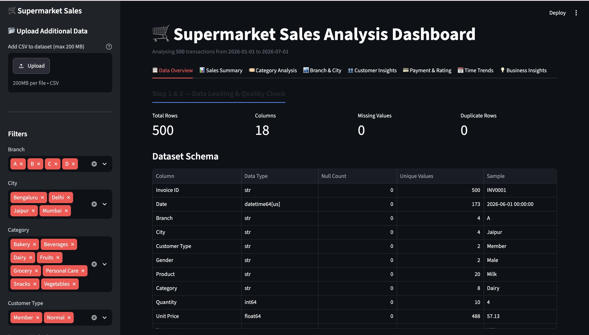

# 🛒 Supermarket Sales Analysis Dashboard

An interactive **Streamlit** dashboard for exploring and analyzing supermarket sales data — built with Python, Pandas, and Plotly, filter by branch/city/category/date, and get auto-generated business insights and recommendations.

Built as part of a Sales Data Analysis Project with the help of IBM BOB (AI coding assistant).

---

## 📌 Features

- **📋 Data Overview** — dataset schema, null/duplicate counts, and automatic verification that `Sales = Quantity × Unit Price`
- **📊 Sales Summary** — key KPIs (revenue, quantity sold, transactions, average order value, average rating) plus category and branch summary tables
- **🏷️ Category Analysis** — revenue by category, revenue share (pie), quantity sold, average order value, and top 15 products by revenue
- **🏙️ Branch & City** — revenue comparison across branches/cities, stacked category breakdown per branch, and a City → Category revenue treemap
- **👥 Customer Insights** — Member vs. Normal customer revenue split, revenue by gender, category preference by gender/customer type, and rating vs. order value scatter plot
- **💳 Payment & Rating** — revenue and transaction share by payment method, average rating by category, and rating distribution
- **📅 Time Trends** — monthly revenue trend, monthly revenue by category, revenue by day of week, and cumulative revenue growth
- **💡 Business Insights** — automatically generated key findings (top category, top city, best-selling product, best sales day, lowest-rated category, etc.) with a decision-summary table and a revenue-vs-rating quadrant chart
- **📂 Upload your own data** — add a CSV to the base dataset directly from the sidebar (duplicate Invoice IDs are automatically removed)
- **🔎 Sidebar filters** — filter by Branch, City, Category, Customer Type, Payment Method, and Date Range
- **📥 Export** — download the combined category & branch summary as a CSV

---

## 🗂️ Project Structure

```
Supermarket-Sales-Analysis-IBMBob-AI/
├── app.py                    # Main Streamlit application
├── requirements.txt          # Python dependencies
├── supermarket_sales.csv     # Base dataset
└── README.md
```

---

## 🧾 Dataset

The app expects a CSV with the following columns:

| Column | Description |
|---|---|
| Invoice ID | Unique transaction identifier |
| Date | Transaction date |
| Branch | Store branch |
| City | City of the branch |
| Customer Type | Member / Normal |
| Gender | Customer gender |
| Product | Product name |
| Category | Product category |
| Quantity | Units sold |
| Unit Price | Price per unit (₹) |
| Payment | Payment method |
| Rating | Customer rating (out of 5) |
| Sales | Total sale value |

Uploaded CSVs must contain the same required columns — the app will flag missing ones.

---

## 🚀 Getting Started

### 1. Clone the repository
```bash
git clone https://github.com/ganeshhshah-jpg/Supermarket-Sales-Analysis-IBMBob-AI.git
cd Supermarket-Sales-Analysis-IBMBob-AI
```

### 2. Create a virtual environment (recommended)
```bash
python -m venv .venv
source .venv/bin/activate      # On Windows: .venv\Scripts\activate
```

### 3. Install dependencies
```bash
pip install -r requirements.txt
```

### 4. Run the app
```bash
streamlit run app.py
```

The dashboard will open automatically at `http://localhost:8501`.

---

## 🛠️ Built With

- [Streamlit](https://streamlit.io/) — web app framework
- [Pandas](https://pandas.pydata.org/) — data manipulation
- [NumPy](https://numpy.org/) — numerical computation
- [Plotly](https://plotly.com/python/) — interactive charts

---

## 📸 Preview



*(See instructions below for how to add this image to your repo.)*

---

## 🤝 Contributing

This is a personal learning project built with the help of IBM BOB. Suggestions and feedback are welcome — feel free to open an issue or fork the repo.

---

## 👤 Author

**Ganesh Shah**      
GitHub: [@ganeshhshah-jpg](https://github.com/ganeshhshah-jpg)    
Email: [ganeshhshah@gmail.com](mailto:ganeshhshah@gmail.com)
